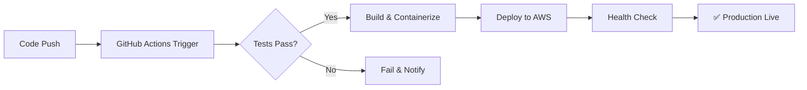

# ☁️ Cloud Infrastructure & CI/CD Automation

> [!success] Deployed in Production
> Multi-cloud DevOps automation across AWS and GitHub Actions, with Python/Shell scripting for operational workflows.

---

## 🎯 What It Does

Designed, deployed, and maintained cloud infrastructure with full CI/CD automation. Covers everything from code commit to production deployment with zero manual intervention.

---

## 🛠️ Tech Stack & Tools

| Tool/Service | Purpose | Reference |
|-------------|---------|-----------|
| GitHub Actions | CI/CD pipeline automation | [github.com/features/actions](https://github.com/features/actions) |
| AWS | Cloud infrastructure | [aws.amazon.com](https://aws.amazon.com) |
| AWS Storage Virtualization | Storage environments | [AWS docs](https://docs.aws.amazon.com) |
| Docker | Containerization | [docker.com](https://www.docker.com) |
| Terraform | Infrastructure as Code | [terraform.io](https://www.terraform.io) |
| Python | Automation scripts | [python.org](https://www.python.org) |
| Shell/Bash | Operational scripting | — |

#technology/aws #technology/docker #technology/terraform #tools/github-actions #tools/python #technology/cicd

---

## 🏗️ Pipeline Architecture

---

## ✅ Key Achievements

- **CI/CD Pipelines**: Fully automated test → build → deploy cycles via GitHub Actions
- **AWS Storage Virtualization**: Configured virtual storage environments for scalable data management
- **Python Automation**: Wrote scripts to streamline repetitive cloud operational tasks
- **Shell Scripting**: Operational automation for Linux-based cloud environments
- **IaC**: Terraform configurations for reproducible infrastructure

---

## 🔗 Connected Notes & Resources

- [[../300 - Skills & Tech/☁️ Cloud & DevOps]] — full cloud skills breakdown
- [[../400 - Certifications/☁️ AWS Certified Cloud Practitioner]] — AWS cert
- [[../400 - Certifications/☁️ Microsoft Azure Fundamentals AZ-900]] — Azure cert
- [[🧬 ZenType — AI Typing App]] — deployed using this pipeline
- [[🗂️ Projects MOC]]

### 📚 External References
- [GitHub Actions Docs](https://docs.github.com/en/actions)
- [AWS Documentation](https://docs.aws.amazon.com)
- [Terraform Registry](https://registry.terraform.io)
- [Docker Hub](https://hub.docker.com)

---

## 💼 Interview Talking Points

> [!tip] Use for Cloud Architect & Systems Analyst roles
> "I've built and deployed end-to-end CI/CD pipelines using GitHub Actions and AWS — not just configured them from templates, but designed the workflow from scratch, including custom Python automation scripts for operational tasks."

^cicd-interview
