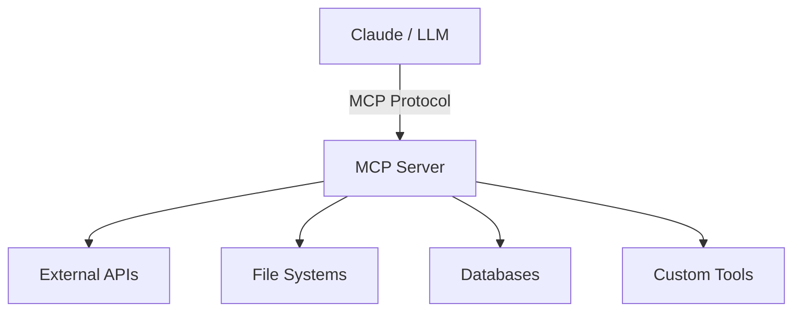

# 🤖 MCP Integration Prototype

> [!info] Cutting-Edge AI Infrastructure
> Prototyped integrations using Anthropic's **Model Context Protocol (MCP)** — the emerging standard for LLM tool-use and agent orchestration.

---

## 🎯 What It Does

Built prototype AI agent integrations using **Anthropic MCP** and **Google AI Studio**, demonstrating deep capability in next-generation LLM tool-use standardization. MCP allows AI models to call external tools, APIs, and data sources in a standardized, composable way.

---

## 🛠️ Tech Stack & Tools

| Tool | Purpose | Reference |
|------|---------|-----------|
| Anthropic MCP | Tool-use protocol | [docs.anthropic.com/mcp](https://docs.anthropic.com/en/docs/agents-and-tools/mcp) |
| Google AI Studio | Model testing & prototyping | [aistudio.google.com](https://aistudio.google.com) |
| Claude API | LLM backbone | [console.anthropic.com](https://console.anthropic.com) |
| Node.js / Python | MCP server implementations | — |

#technology/mcp #technology/anthropic #technology/llm #tools/google-ai-studio #tools/claude-api

---

## 🏗️ Architecture

> [!note] Why MCP Matters
> MCP is to AI agents what REST was to web APIs — it standardizes how LLMs communicate with the outside world. Understanding MCP now = being ahead of 99% of engineers.

---

## ✅ What This Demonstrates

- Hands-on experience with **agentic AI architecture** (not just prompting)
- Ability to build **MCP servers** that expose tools to LLMs
- Understanding of **LLM orchestration** patterns
- Early adopter of emerging industry standards

---

## 🔗 Connected Notes & Resources

- [[../300 - Skills & Tech/🤖 AI & LLM Integrations]] — broader AI skills context
- [[../300 - Skills & Tech/⚡ Skills MOC]] — full stack overview
- [[../700 - GitHub/🐙 GitHub Profile]] — prototype repos
- [[🗂️ Projects MOC]] — all projects

### 📚 External References
- [Anthropic MCP Docs](https://docs.anthropic.com/en/docs/agents-and-tools/mcp)
- [MCP GitHub (official)](https://github.com/modelcontextprotocol)
- [Google AI Studio](https://aistudio.google.com)

---

## 💼 Interview Talking Points

> [!tip] Use this for Pre-Sales AI Engineer & TAM roles
> "I've prototyped production MCP integrations — I understand not just how to use AI APIs, but how to architect the infrastructure that connects AI to enterprise systems. MCP is what companies like Anthropic, Google, and Microsoft are standardizing around for agentic workflows."

^mcp-interview
